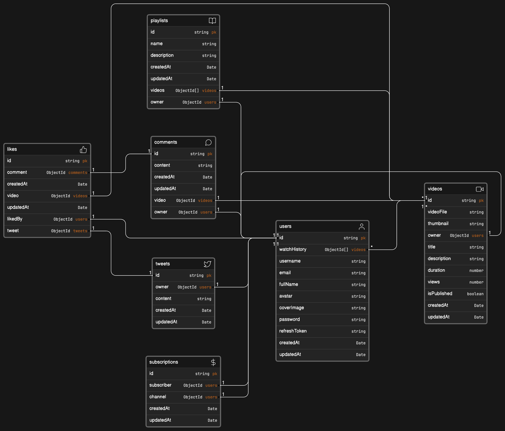

# Tube Backend

Tube Backend is a Node.js Express application with MongoDB using Mongoose, designed to provide a backend API for managing YouTube-like functionalities. This project includes various controllers for handling comments, likes, tweets, users, dashboard, subscriptions, videos, playlists, health checks, and more.


Link: [https://app.eraser.io/workspace/JRczTFa0G4do8w2TlLoW](https://app.eraser.io/workspace/JRczTFa0G4do8w2TlLoW)

## Getting Started

These instructions will help you set up the project on your local machine for development and testing purposes.

### Prerequisites

Make sure you have the following installed on your machine:

- [Node.js](https://nodejs.org/)
- [MongoDB](https://www.mongodb.com/try/download/community)

## Technologies Used

- Node.js
- Express.js
- MongoDB
- Cloudinary (must have an account)

### Installation

1. Clone the repository:

   ```bash
   git clone https://github.com/your-username/tube-backend.git
   ```

2. Navigate to the project directory:

   ```bash
   cd tube-backend
   ```

3. Install dependencies:

   ```bash
   npm install
   ```

4. Configure the environment variables:

   Create a `.env` file in the root of the project And add all credential as described below.

   ```env
   PORT=3000
   MONGODB_URI=MONGODB_URI
   CORS_ORIGIN=*
   ACCESS_TOKEN_SECRET=YOUR_SECRET
   ACCESS_TOKEN_EXPIRY=1d
   REFRESH_TOKEN_SECRET=YOUR_SECRET
   REFRESH_TOKEN_EXPIRY=10d

   CLOUDINARY_CLOUD_NAME=tube-backend
   CLOUDINARY_API_KEY=YOUR_API_KEY
   CLOUDINARY_API_SECRET=YOUR_SECRET
   ```

### Usage

Start the development server:

```bash
npm start
```

Certainly! Here's a shorter version:

---

## API Overview

### User

- **Get Current User:** `/users/current-user` (GET)
- **User Login:** `/users/login` (POST)
- **User Register:** `/users/register` (POST)
- **Update User Avatar:** `/users/updateUserAvatar` (POST)
- **Update Cover Image:** `/users/updateCoverImage` (POST)
- **Update Password:** `/users/changeCurrentPassword` (POST)
- **User Logout:** `/users/logout` (POST)

### Video

- **Get Video:** `/videos/{videoId}` (GET)
- **Get All Videos:** `/videos` (GET)
- **Publish Video:** `/videos` (POST)
- **Toggle Video Publish:** `/videos/{videoId}` (POST)
- **Update Video:** `/videos/{videoId}` (PATCH)
- **Delete Video:** `/videos/{videoId}` (DELETE)

### Playlist

- **Get User Playlist:** `/playlist/u/{userId}` (GET)
- **Create Playlist:** `/playlist` (POST)
- **Add Video to Playlist:** `/playlist/add/{playlistId}/{videoId}` (PATCH)
- **Remove Video from Playlist:** `/playlist/remove/{playlistId}/{videoId}` (PATCH)
- **Delete Playlist:** `/playlist/{playlistId}` (DELETE)

### Comments

- **Add Comment:** `/comments/{videoId}` (POST)
- **Get Comments:** `/comments/{videoId}` (GET)
- **Update Comment:** `/comments/c/{commentId}` (PATCH)
- **Delete Comment:** `/comments/c/{commentId}` (DELETE)

### Likes

- **Toggle Video Like:** `/likes/toggle/v/{videoId}` (POST)
- **Toggle Comment Like:** `/likes/toggle/c/{commentId}` (POST)

### Dashboard

- **Get Channel Videos:** `/dashboard/videos` (GET)
- **Get Channel Stats:** `/dashboard/stats` (GET)

---

## Issue Tracker

If you encounter any issues with the project, please use the GitHub issue tracker to report them. We welcome your feedback!

[**Create a new issue**](https://github.com/jenilmangukiya/tube-backend/issues/new)

## Contributing

If you wish to contribute to this project, please feel free to contribute.
